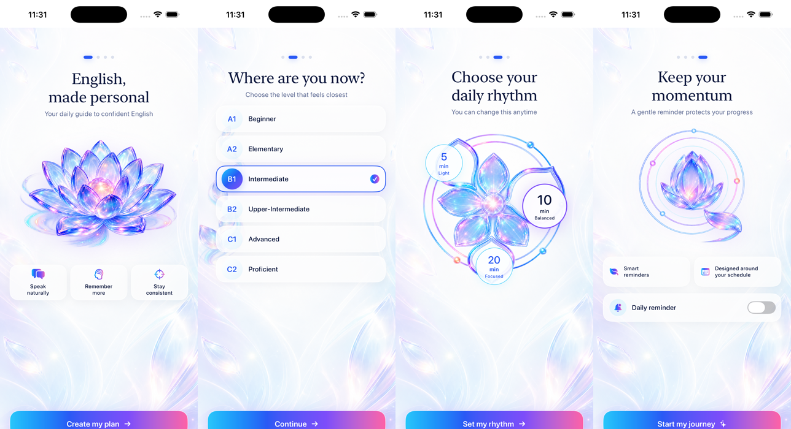
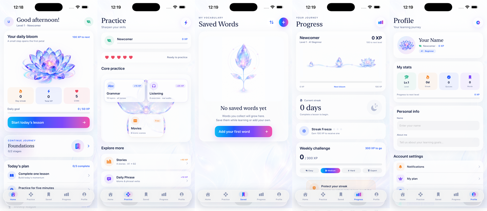

<div align="center">

# 🪷 Lana

**Your personal English tutor — daily practice that blooms.**

A beautifully crafted iOS app for learning English: quizzes, grammar, listening,
stories and movie scenes, wrapped in a calm "Lotus" design with XP, streaks and hearts.


</div>

---

## ✨ Screens

**Onboarding — English, made personal**



**Main tabs — Home · Practice · Saved · Progress · Profile**



---

## 🌸 Features

- **Daily bloom** — a living lotus on the home screen that grows with your daily XP
- **Quizzes & grammar** — CEFR-graded quizzes (A1 → C2), grammar topics with explanations
- **Listening & movies** — audio exercises and iconic movie scenes
- **Stories & reading** — graded stories with tap-to-save vocabulary
- **Vocabulary** — word of the day, saved words, spaced-repetition review (SRS)
- **Practice arcade** — Speed Review, Match Madness, Word Scramble, Sentence Builder, Fill-the-Blank, Typing & Audio quizzes, pronunciation practice
- **Motivation loop** — XP & levels, day streaks with streak freezes, hearts, daily missions, weekly challenges, leagues and a trophy room
- **Gentle reminders** — configurable daily notifications
- **Local-first** — all progress stored on-device in SQLite; content shipped as JSON packs

## 🏗 Architecture

MVVM on SwiftUI, no external dependencies.

```
Lana/
├── Views/          # SwiftUI screens (50+ views)
├── ViewModels/     # ObservableObject view models
├── Models/         # Domain models (quizzes, grammar, stories, SRS…)
├── Services/       # SQLite, content repository, TTS, haptics, quests…
├── Components/     # Reusable UI (cards, charts, confetti, tab bar…)
├── Core/
│   ├── Design/     # Lotus design system: palette, typography, screens
│   └── Navigation/ # Navigation system
└── Content/        # JSON content packs (words, grammar, quizzes…)
```

Design language lives in `Core/Design/LotusAppDesign.swift` — pearl backgrounds,
ink typography and the aurora gradient (aqua → cobalt → violet → coral) used across
buttons, progress lines and the floating tab bar.

## 🚀 Getting Started

1. Clone the repo
   ```bash
   git clone https://github.com/iccupwin/Lana.git
   ```
2. Open `Lana.xcodeproj` in **Xcode 26+**
3. Select an iPhone simulator (iOS 26+) and **Run** ▶

No API keys, accounts or package resolution required — everything runs offline.

## 🗺 Content

Learning content is data-driven and lives in `Lana/Content/`:

| Pack | What's inside |
|---|---|
| `quizzes.json` | CEFR-graded quiz collections |
| `grammar.json` | Grammar topics & rules |
| `listening.json` | Listening exercises |
| `movies.json` | Movie-scene dialogues |
| `stories.json` | Graded reading stories |
| `words.json` | Vocabulary with translations |
| `idioms.json` / `phrases.json` | Idioms & daily phrases |

Add new content by extending the JSON packs — no code changes needed.

---

<div align="center">
<sub>Built with SwiftUI · Designed with 🪷</sub>
</div>
